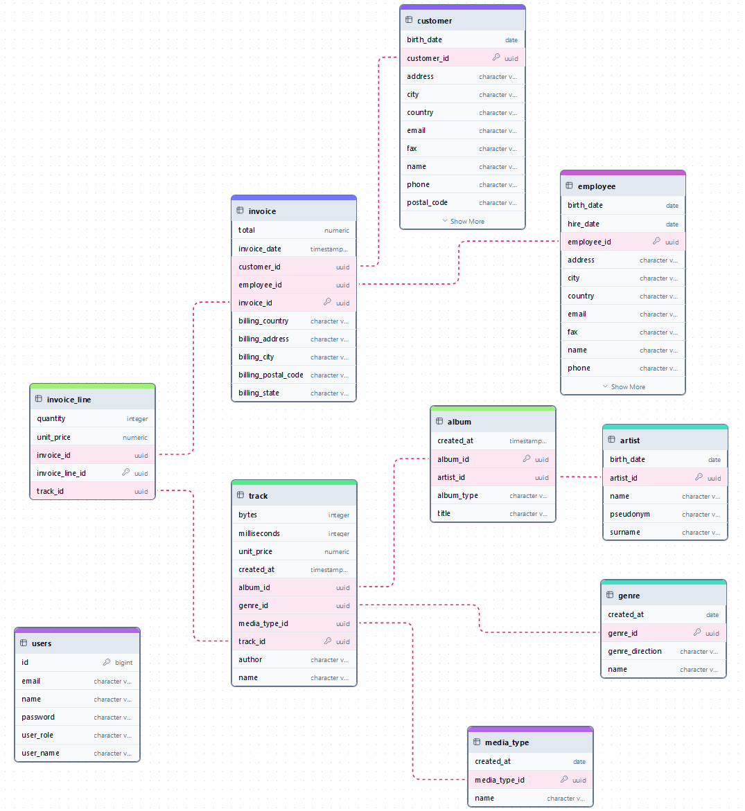

# Rest-api spring boot boilerplate
- <h4> Небольшой пет-проект rest-api </h4>
- <h4> Включает: Spring Boot, Spring Data JPA, Spring Validation, Spring Security (используется JWT Token), Mapstruct, Lombok, Swagger. </h4>
- <h4> Если у Вас интересный продукт и Вы ищете AQA - мой <a href="https://t.me/TommyBahama" rel="noopener noreferrer" class="link">telegram контакт</a> и <a href="mailto:Obvintsev.Aleksey@yandex.ru" rel="noopener noreferrer" class="link">почта</a> </h4> 

<hr>

- <h4>Db Name: DigitalStore </h4>
- <h4> Db Engine: PostgreSQL </h4>


<h3><p style="text-align: center;">ER - diagram</p>
 


<hr>

## Rest-api endpoints

Swagger документация - http://localhost:8181/api/swagger-ui/index.html


```
registration-controller
  POST /register - создать пользователя

login-controller
  POST /login - авторизоваться за пользователя
  
artist-controller
  PUT /artists - Обновить артиста
  POST /artists - Создание артиста
  GET /artists/{id} - Получить артиста по идентификатору
  DELETE /artists/{id} - Удаление артиста
  GET /artists/artists-by-pseudonym/{pseudonym} - Получить список артистов по псевдониму
  GET /artists/artists-by-name/{name} - Получить список артистов по имени
  
genre-controller
  PUT /genres - Обновить жанр
  POST /genres - Создать жанр
  GET /genres/{id} - Получить жанр по идентификатору
  DELETE /genres/{id} - Удалить жанр
  GET /genres/all - Получить все жанры

media-type-controller  
  PUT /media-types - Обновить медиа-тип
  POST /media-types - Создать медиа-тип
  GET /media-types/{id} - Получить медиа-тип по идентификатору
  DELETE /media-types/{id} - Удалить медиа-тип
  GET /media-types/all - Получить все медиа-типы

album-controller
  PUT /albums - Обновить альбом
  POST /albums - Создать альбом
  GET /albums/{id} - Получить альбом по идентификатору
  DELETE /albums/{id} - Удалить альбом
  GET /albums/albums-by-title/{title} - Получить список альбомов по заголовку
  GET /albums/albums-by-artist-pseudonym/{pseudonym} - Получить список альбомов по псевдониму артиста
  GET /albums/albums-by-artist-id/{artistId} - Получить список альбомов по идентификатору артиста
  
track-controller
  PUT /tracks - Обновить аудиозапись
  POST /tracks - Создать аудиозапись
  GET /tracks/{id} - Получить аудиозапись по идентификатору
  DELETE /tracks/{id} - Удалить аудиозапись
  GET /tracks/tracks-by-artist-pseudonym/{pseudonym} - Получить все аудиозаписи по псевдониму артиста
  GET /tracks/tracks-by-artist-id/{id} - Получить все аудиозаписи по идентификатору артиста
  GET /tracks/all-tracks-by-media-type/{id} - Получить все аудиозаписи по идентификатору медиа-типа
  GET /tracks/all-tracks-by-genre/{id} - Получить все аудиозаписи по идентификатору жанра
  GET /tracks/all-tracks-by-album/{id} - Получить все аудиозаписи по идентификатору альбома
  
employee-controller  
  PUT /employees - Обновить работника
  POST /employees - Создать работника
  GET /employees/{id} - Получить работника по идентификатору
  DELETE /employees/{id} - Удалить работника
  GET /employees/lastname/{name} - Получить список работников по фамилии
  GET /employees/firstname/{name} - Получить список работников по имени
  
customer-controller  
  PUT /customers - Обновить клиента
  POST /customers - Создать клиента
  GET /customers/{id} -Получить клиента по идентификатору
  DELETE /customers/{id} - Удалить клиента
  GET /customers/lastname/{name} - Получить список клиентов по фамилии
  GET /customers/firstname/{name} - Получить список клиентов по имени
  
invoice-controller  
  PUT /invoices - Обновить заказ
  POST /invoices - Создать заказ
  GET /invoices/{id} - Получить заказ по идентификатору
  DELETE /invoices/{id} - Удалить заказ
  GET /invoices/invoices-by-employee/{id} - Получить заказ по идентификатору сотрудника
  GET /invoices/invoices-by-customer/{id} - Получить заказ по идентификатору клиента
  
invoice-line-controller  
  PUT /invoice-lines - Обновить сформированный заказ
  POST /invoice-lines - Создать сформированный заказ
  GET /invoice-lines/{id} - Получить сформированный заказ по идентификатору
  DELETE /invoice-lines/{id} - Удалить сформированный заказ
  GET /invoice-lines/invoice-lines-by-track/{id} - Получить список сформированных заказов по идентификатору аудиозаписи
  GET /invoice-lines/invoice-line-by-invoice/{id} - Получить список сформированных заказов по идентификатору заказа
```


