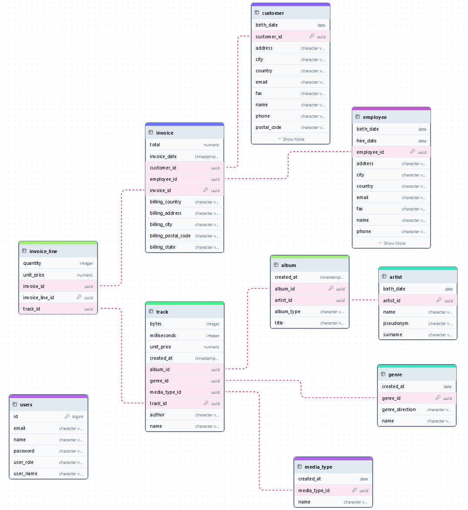

## Project Overview


**DigitalStore** is a Spring Boot REST API for a digital media store that manages artists, albums, tracks, genres, media types, customers, employees, and sales invoices. The project uses PostgreSQL for persistence and JWT tokens for authentication.

**Tech Stack:**
- Language: Java 17
- Framework: Spring Boot 3.3.3
- Build Tool: Maven
- Database: PostgreSQL
- Authentication: JWT (java-jwt library)
- API Documentation: OpenAPI/Swagger (springdoc-openapi)
- ORM: Spring Data JPA with Hibernate
- Mapping: MapStruct
- Annotation Processing: Lombok

**Swagger docs:**  - http://localhost:8181/api/swagger-ui/index.html

#### Build the Project
```bash
./mvnw clean package
```

#### Run Tests
```bash
./mvnw test
```

#### Run Locally (requires PostgreSQL)
```bash
./mvnw spring-boot:run
```

Connection defaults:
- Database: `DigitalStore`
- Host: `localhost:5432`
- User: `postgres`
- Password: `postgres`

Override via environment variables:
```bash
POSTGRES_DB_SERVER_ADDRESS=localhost POSTGRES_DB_SERVER_PORT=5432 POSTGRES_USER=postgres POSTGRES_PASSWORD=postgres ./mvnw spring-boot:run
```

### Docker
```bash
# Dockerfile uses multi-stage build: Maven stage compiles, Java 17 stage runs the JAR.
# Build and run with Docker Compose
docker-compose up --build

# Stop and remove containers + volumes (нужно при смене версии postgres или сбросе БД)
docker-compose down -v
```

<h3><p style="text-align: center;">ER - diagram</p>
 


<hr>

## Rest-api endpoints

All prefixed with `/api`. Swagger UI: `http://localhost:8181/api/swagger-ui/index.html`

```
POST   /register                                          - регистрация пользователя
POST   /login                                             - авторизация

POST   /artists                                           - создать артиста
PUT    /artists                                           - обновить артиста
GET    /artists/{id}                                      - получить артиста по id
DELETE /artists/{id}                                      - удалить артиста
GET    /artists/artists-by-pseudonym/{pseudonym}          - поиск по псевдониму
GET    /artists/artists-by-name/{name}                    - поиск по имени

POST   /genres                                            - создать жанр
PUT    /genres                                            - обновить жанр
GET    /genres/{id}                                       - получить жанр по id
DELETE /genres/{id}                                       - удалить жанр
GET    /genres/all                                        - все жанры

POST   /media-types                                       - создать медиа-тип
PUT    /media-types                                       - обновить медиа-тип
GET    /media-types/{id}                                  - получить медиа-тип по id
DELETE /media-types/{id}                                  - удалить медиа-тип
GET    /media-types/all                                   - все медиа-типы

POST   /albums                                            - создать альбом
PUT    /albums                                            - обновить альбом
GET    /albums/{id}                                       - получить альбом по id
DELETE /albums/{id}                                       - удалить альбом
GET    /albums/albums-by-title/{title}                    - поиск по названию
GET    /albums/albums-by-artist-pseudonym/{pseudonym}     - поиск по псевдониму артиста
GET    /albums/albums-by-artist-id/{artistId}             - поиск по id артиста

POST   /tracks                                            - создать трек
PUT    /tracks                                            - обновить трек
GET    /tracks/{id}                                       - получить трек по id
DELETE /tracks/{id}                                       - удалить трек
GET    /tracks/tracks-by-artist-pseudonym/{pseudonym}     - поиск по псевдониму артиста
GET    /tracks/tracks-by-artist-id/{id}                   - поиск по id артиста
GET    /tracks/all-tracks-by-media-type/{id}              - поиск по id медиа-типа
GET    /tracks/all-tracks-by-genre/{id}                   - поиск по id жанра
GET    /tracks/all-tracks-by-album/{id}                   - поиск по id альбома

POST   /employees                                         - создать сотрудника
PUT    /employees                                         - обновить сотрудника
GET    /employees/{id}                                    - получить сотрудника по id
DELETE /employees/{id}                                    - удалить сотрудника
GET    /employees/lastname/{name}                         - поиск по фамилии
GET    /employees/firstname/{name}                        - поиск по имени

POST   /customers                                         - создать клиента
PUT    /customers                                         - обновить клиента
GET    /customers/{id}                                    - получить клиента по id
DELETE /customers/{id}                                    - удалить клиента
GET    /customers/lastname/{name}                         - поиск по фамилии
GET    /customers/firstname/{name}                        - поиск по имени

POST   /invoices                                          - создать заказ
PUT    /invoices                                          - обновить заказ
GET    /invoices/{id}                                     - получить заказ по id
DELETE /invoices/{id}                                     - удалить заказ
GET    /invoices/invoices-by-employee/{id}                - заказы по id сотрудника
GET    /invoices/invoices-by-customer/{id}                - заказы по id клиента

POST   /invoice-lines                                     - создать позицию заказа
PUT    /invoice-lines                                     - обновить позицию заказа
GET    /invoice-lines/{id}                                - получить позицию заказа по id
DELETE /invoice-lines/{id}                                - удалить позицию заказа
GET    /invoice-lines/invoice-lines-by-track/{id}         - позиции по id трека
GET    /invoice-lines/invoice-line-by-invoice/{id}        - позиции по id заказа
```


## Architecture

### Layered Structure

```
src/main/java/com/personal/DigitalStore/
├── ChinookApplication.java (entry point)
├── controllers/                 # REST endpoints
├── services/                    # Business logic layer
│   └── security/                # Auth-related services (UserService, UserValidationService)
├── repositories/                # Spring Data JPA repositories
├── models/                      # JPA entities
│   └── enumpack/                # Enums (UserRole, AlbumType, GenreDirection, Position)
├── dto/                         # DTOs for request/response mapping
│   └── security/                # Auth DTOs (LoginRequest, etc.)
├── mappers/                     # MapStruct mappers (entity <-> DTO)
├── config/                      # Spring configuration
│   └── jwt/                     # JWT token management
├── exceptions/                  # Error handling
│   ├── custom/                  # Custom exceptions
│   ├── Handler/                 # Exception handlers (@RestControllerAdvice)
│   └── Payload/                 # Error response payloads
├── utils/                       # Utilities
│   └── swagger/                 # Swagger annotation helpers
└── resources/
    ├── application.yml          # Main config
    ├── init.sql                 # Database schema
    ├── messages/                # i18n property files
    └── pictures/
        └── db_er.png            # ER-диаграмма базы данных
```

### Database Schema

Core entities:
- **User**: System users with JWT authentication
- **Artist**: Music artists (name, surname, pseudonym, birth_date)
- **Album**: Albums with artist reference (title, album_type, created_at)
- **Track**: Tracks with album/genre/media_type references (name, author, unit_price, milliseconds, bytes)
- **Genre**: Music genres with direction enum
- **MediaType**: Track media types (e.g., MP3, WAV)
- **Employee**: Staff members (position, hire_date, contact info)
- **Customer**: Customers for invoicing (contact info, address)
- **Invoice**: Sales invoices with customer/employee references
- **InvoiceLine**: Line items in invoices linking to tracks

Most entity IDs are UUIDs; User IDs are Long with auto-increment.


### Security

**JWT Implementation:**
1. User registers/logs in → JwtTokenManager generates signed JWT with username and role claim
2. Client includes token in Authorization header on subsequent requests
3. JwtAuthenticationFilter validates token on each request
4. SecurityConfiguration permits only `/register`, `/login`, `/v3/api-docs/**`, `/swagger-ui/**`, `/actuator/**` without auth
5. All other endpoints require valid token (SessionCreationPolicy.STATELESS)

**Config Class:** JwtProperties reads `jwt.secretKey`, `jwt.issuer`, `jwt.expirationMinute` from application.yml (default: 10 min expiration)

### Service Layer Patterns

- **CRUD Services**: Follow standard patterns (get, create, update, delete)
- **Exception Handling**: Custom exceptions (NotFoundInDBException, InvalidFieldException, AlreadyExistsException, RegistrationException) thrown and handled by @RestControllerAdvice
- **DTOs**: Each entity has corresponding DTO and SaveDTO (for creation/update)
- **MapStruct**: Automatic entity <-> DTO mapping via generated mapper interfaces
- **Transactional**: Services use @Transactional and @Transactional(readOnly = true) annotations

### Validation & Error Handling

- Input validation via JSR-303 annotations (@Valid, @NotNull, etc.) on DTOs
- Global exception handlers:
    - `ApiRequestExceptionHandler`: Custom API exceptions
    - `ValidationAdvice`: Bean validation errors
    - `RegistrationControllerAdvice`, `LoginControllerAdvice`: Auth-specific errors
- Error responses standardized via ErrorResponse, ValidationErrorResponse, ApiExceptionResponse payloads
- Messages externalized to `.properties` files in `src/main/resources/messages/`

### Key Configuration

**application.yml** settings:
- Server port: 8181, context-path: /api
- Jackson: fail-on-empty-beans disabled, ANT_PATH_MATCHER for swagger
- JPA: PostgreSQL dialect, validate DDL mode (no auto-migration), standard naming strategy
- Management: Health endpoints exposed, detailed health info enabled
- Logging: Spring framework at INFO level

**JWT config** (in application.yml):
- `jwt.secretKey`: Secret for HMAC256 signing
- `jwt.issuer`: Token issuer claim
- `jwt.expirationMinute`: Token lifetime in minutes

### Development Notes

- **Swagger Annotations:** Custom annotations (ApiCreate, ApiGet, ApiUpdate, ApiDelete) provide reusable Swagger metadata
- **Lombok:** @Data, @Builder, @RequiredArgsConstructor, @Slf4j reduce boilerplate
- **String in Russian:** Many validation messages and comments are in Russian; preserve when editing
- **UUID for IDs:** Most entities use UUID generation; User entity uses Long with IDENTITY strategy
- **Eager Data Loading:** Watch for N+1 queries; many relationships use FetchType.LAZY—verify query performance with complex joins
- **No Test Suite:** Currently contains only ChinookApplicationTests (basic context load test); add tests as you add features

### Environment & Build Details

- Maven wrapper (`mvnw`, `mvnw.cmd`) included for reproducible builds
- Parent POM: spring-boot-starter-parent 3.3.3
- Compiler: Java 17 with annotation processor configuration for Lombok → MapStruct ordering
- Plugins: spring-boot-maven-plugin, asciidoctor-maven-plugin (for API docs generation)

# API Tests (rest-assured-api-tests/)

Отдельный Maven-модуль с end-to-end API тестами, покрывающими все контроллеры DigitalStore.

**Tech Stack:**
- RestAssured 5.5.0 — HTTP клиент для API запросов
- JUnit 5 — тест-раннер с поддержкой вложенных классов и упорядочивания
- AssertJ — soft assertions (не останавливаются на первом упавшем)
- Allure 2.29.0 — отчётность (результаты в `target/allure-results`)
- Faker + Instancio — генерация тестовых данных
- Lombok, Jackson — утилиты

**Запуск тестов:**
```bash
cd rest-assured-api-tests
mvn clean test
```

Требует запущенного приложения на `http://localhost:8181/`.

**Структура модуля:**
```
rest-assured-api-tests/src/test/java/digital/store/api/
├── configs/Config.java          # RequestSpec/ResponseSpec, EndpointUtil (все URL)
├── tests/DigitalStoreApiTests.java  # Все тесты (единственный тест-класс)
├── model/                       # DTO и SaveDTO для десериализации ответов
│   ├── security/                # LoginPojo, RegistrationPojo
│   └── enumpack/                # AlbumType, GenreDirection, Position
├── utils/
│   ├── DataUtil.java            # Фабрика тестовых данных (Faker + Instancio)
│   ├── ISendRequest.java        # Интерфейс с методами post/get/put/delete
│   ├── ICheckResponse.java      # Интерфейс с методами проверки ответов
│   └── ResponseDto.java         # Обёртка над ответом (статус + тело)
```

**Организация тестов в DigitalStoreApiTests:**
- `AuthTest` (`@Order(1)`) — регистрация пользователя, получение JWT токена
- `ControllerTests` (`@Order(2)`) — тесты всех контроллеров, методы упорядочены по имени (A→L)
  - `testAArtistController` — artist CRUD + поиск по имени и псевдониму
  - `testBBAlbumController` — album CRUD + поиск по title, artistId, pseudonym
  - `testCGenreController` — genre CRUD + getAll
  - `testDMediaTypeController` — media-type CRUD + getAll
  - `testFCustomerController` — customer CRUD + поиск по имени/фамилии
  - `testGEmployeeController` — employee CRUD + поиск по имени/фамилии
  - `testHInvoiceController` — invoice CRUD + поиск по customer/employee
  - `testJTrackController` — track CRUD + поиск по album, artist, genre, mediaType
  - `testLInvoiceLineController` — invoice-line CRUD + поиск по track/invoice

Каждый тест сам создаёт необходимые зависимые сущности через API (без моков и фикстур БД).

**CI интеграция:**
- Тесты запускаются в GitHub Actions (`.github/workflows/ci.yml`) после старта приложения через Docker Compose
- Allure отчёт публикуется на GitHub Pages ветки `gh-pages`


